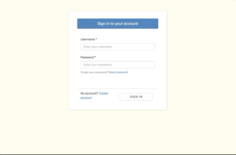

# Notepad

[Demo](https://rct-amplify-notepad.s3.amazonaws.com/index.html)

Need to jot down some notes or remember stuff? 
Use a notepad! (like this one)

Utilizes [AWS Amplify](https://aws.amazon.com/amplify) to effortlessly tie together a fullstack serverless application. Includes authentication, data, file storage, and more..

If you don't want to create an account, feel free to use `test@example.com` for the username *and* password.
 
 
<ins>Built with</ins> 
React.js 
GraphQL 
AWS Amplify / AppSync / Cognito / DynamoDB / Lambda / s3
